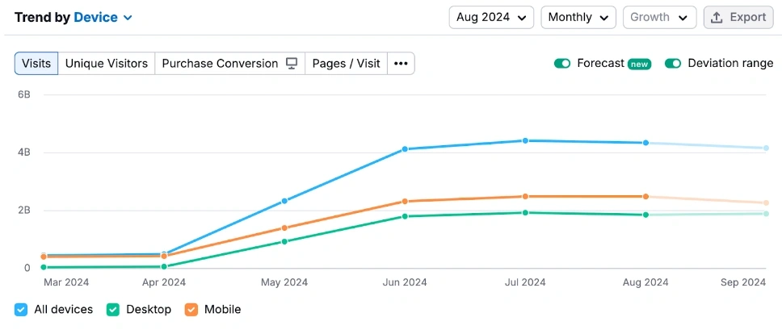

# HIghload-Twitter

## 1. Тема и целевая аудитория
Twitter — это социальная сеть микроблогов, в которой пользователи могут публиковать короткие сообщения длиной до 280 символов, изображения, видеоролики или ссылки. Сообщения в Twitter называются твитами, что означает «щебетать» или «чирикать». Зарегистрированные пользователи могут их и публиковать, и читать, незарегистрированные — только читать.

### MVP
1. Регистрация/авторизация
2. Создать твит
3. Смотреть ленту твитов
4. Подписаться на других пользователей
5. Писать комментарии и оставлять реакции на твиты
6. Рекомендательная система твитов

### Целевая аудитория

Метрики вовлеченности:
- MAU 611M  [1]
- DAU 250-300M [1]
- среднее время сессии варируется, в зависимости от страны пользователя, но среднее значение примерно 30.9 минут в день. [2]
- Ежедневно на платформе публикуется около 500 миллионов твитов, что составляет примерно 5 787 твитов в секунду. [3]
- 79% используют твиттер с целью познавания новых фаактов и информации.
- Около 500 тыс. аккаунтов создается в X каждый день. [3]
- 42% посещений X приходится на мобильные устройства. [3]

Интересные факты:
- В мае 2024 было 600 - 3.44M
- максимальное количество подписчкиков - 169.3M на Илона Маска

Аудитория[2]:

|Возраст| % женщин | % мужчин |
|-----|---|-----|
|13-17|1.30%|1.20%|
|18-24|15.20%|19.30%|
|25-34|13.00%|22.40%|
|35-49|6.70%|13.10%|
|50+|2.90%|4.90%|

|№| Страна | Кол-во пользователей |
|-|---|-----|
|1|США|105.42M|
|2|Япония|73.40M|
|3|Индия|26.08M|
|4|Великобритания|25.60M|
|5|Индонезия|24.69M|

## 2. Расчет нагрузки
### Продуктовые метрики
- MAU 611M
- DAU 250-300M
- На каждый твит в среднем 3.4 ответа
- 63% пользователей активно пользуются реакциями на твиты
- Текст твита – 280 символов (~0,28 КБ)
- Медиа (фото/видео) в твитах – 10% твитов содержат фото (~2,5 МБ), 2% твитов содержат видео (~10 МБ)
- Профиль пользователя (аватар, описание и др.) – ~200 КБ
- История действий (подписки, лайки, комментарии, просмотры) – ~500 КБ
- Рекомендации (кеширование данных) – ~5 МБ

Средний пользователь делает 5 твитов в день:
- Текст: 5 × 0,28 КБ = 1,4 КБ/день
- Фото: 10% × 5 × 2,5 МБ = 1,25 МБ/день
- Видео: 2% × 5 × 10 МБ = 1 МБ/день

За год от одного пользователя требуется сохранить:
- Текст: 1,4 КБ × 365 = 0.5 МБ
- Фото: 1,25 МБ × 365 = 0,5 ГБ
- Видео: 1 МБ × 365 = 0,36 ГБ
Итоговый объем хранения на одного пользователя: ~1 ГБ

Среднее количество действий пользователя в день:
|Действие| Кол-во в день |
|----|---|
|Создать твит|5|
|Смотреть ленту твитов|50|
|Подписаться|0.33|
|Писать комментарии и ставить реакции|10|
|Обновление ленты (рекомендации)|20|

### Технические метрики
Размер хранения
Общий объем за год = 611М × 1 ГБ= 0.569038 ЭБ = 583 ПБ

|Данные| Размер на 1 пользователя за год | Общий размер |
|-----|---|-----|
|Текст твита|0.5МБ|0.29 ПБ|
|Фото|0.5ГБ|291.35 ПБ|
|Видео|0.36ГБ|233.6 ПБ|
|Профиль, реакции, подписки, кэш|6МБ|3.48 ПБ|

Возьмем предельный DAU, который был зафиксирован за 2024 - 300 млн
Тогда:
Общий суточный трафик (ПБ/день) = Объем данных на 1 действие × Среднее число действий в день (на 1 пользователя) × 300млн

Сетевой трафик
| Тип действия               | Объем данных на 1 действие | Среднее число действий в день (на 1 пользователя) | Общий суточный трафик (ПБ/день) |
|----------------------------|---------------------------|----------------------------------|--------------------------------|
| Создание твита (текст)     | 0,28 КБ                    | 5                                | 0,42 ПБ                        |
| Загрузка фото              | 2,5 МБ                     | 0,5                              | 0,38 ПБ                        |
| Загрузка видео             | 10 МБ                      | 0,1                              | 0,30 ПБ                        |
| Просмотр ленты (рекомендации) | 0,3 МБ                     | 50                               | 4,50 ПБ                        |
| Лайки, комменты, подписки  | 0,1 МБ                     | 10                               | 0,90 ПБ                        |
| Запросы рекомендаций       | 0,5 МБ                     | 20                               | 3,00 ПБ                        |
| **Итого**                  | —                           | —                                | **~9,5 ПБ/день**               |

Возьмем предельный DAU, который был зафиксирован за 2024 - 300 млн
Тогда:
Суточное количество запросов (млрд) = Среднее число действий в день (на 1 пользователя) × 300млн
RPS (на 300 млн DAU) = Суточное количество запросов (млрд) / 86400 секунд

RPS:
| Запрос                     | Суточное количество запросов (млрд) | RPS (на 300 млн DAU) |
|----------------------------|--------------------------------|--------------|
| Создание твита             | 1,50                           | 17 360       |
| Загрузка фото              | 0,150                          | 1 735        |
| Загрузка видео             | 0,030                          | 347          |
| Просмотр ленты             | 15,00                          | 173 610      |
| Реакции (лайки, комменты, подписки) | 3,00             | 34 722       |
| Рекомендации (обновление ленты) | 6,00              | 69 444       |
| **Итого**                  | **25,68 млрд**                 | **297 218**  |

## Список источников
1. https://analyzify.com/statsup/x-twitter
2. https://soax.com/research/twitter-active-users
3. https://www.charleagency.com/articles/twitter-x-statistics
